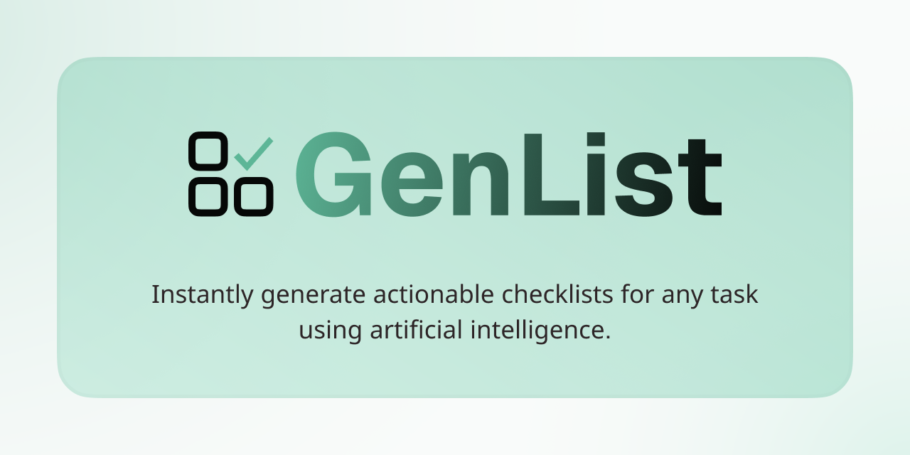

# GenList AI

## About this Project
This is the codebase for GenList AI, a project by Divi Newton. Accessible at https://genlist.divinewton.com. Instantly generate actionable checklists for any task using artificial intelligence. 

Website made using Next.js React framework, TypeScript, and Tailwind CSS. See all files and images here.

## Resources
- Hosting: Vercel
- Source Management: [GitHub](https://github.com/divinewton/GenList-AI)
- Colors: [Realtime Colors](https://www.realtimecolors.com/?colors=060807-f9fbfa-5db697-96ddc4-58dbae&fonts=Inter-Inter)
- Component Library: [shadcn](https://ui.shadcn.com/docs/components)
- Gemini API: [Google AI Studio](https://aistudio.google.com/usage)